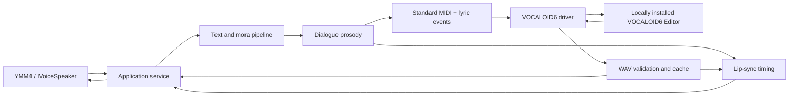

# Architecture

Status: **Accepted for public beta implementation**

## Principles

- プロプライエタリ製品は境界の外側に置く
- 標準ファイル形式と公開UIだけを利用する
- テキスト処理、シーケンス生成、口パク生成を純粋ロジックとして分離する
- UI Automationは交換可能なドライバーに隔離する
- すべての外部待機にタイムアウトとキャンセルを設ける
- 自動化に失敗しても手動補助モードで作業を継続できるようにする

## Proposed Components

### YMM4 Adapter

`IVoicePlugin`と`IVoiceSpeaker`を実装し、YMM4の設定、音声生成要求、キャッシュ方針をApplication serviceへ渡します。YMM4のアセンブリ参照はこの層に限定します。

### Text and Mora Pipeline

入力正規化、読み変換、モーラ分割、句読点・休符を扱います。辞書や外部ライブラリはインターフェースの背後に置き、単体テスト可能にします。

### Dialogue Prosody

モーラごとの長さ、休符、基準音、アクセント近似を生成します。同一入力と設定から同一結果を返す決定的な処理にします。

### Sequence Writer

VOCALOID6が読める標準MIDIを生成します。VPRは生成・解析しません。文字コードと歌詞イベントの互換性はPhase 0で確定します。

### VOCALOID6 Driver

次の2実装を同じ契約で提供します。

- Assisted driver: MIDIを開き、ユーザーのWAV書出しを待つ
- Automation driver: UI Automationで読込、ボイス選択、書出しを行う

ドライバーは状態遷移、操作名、タイムアウト、診断結果を返します。座標クリックは最後の手段とし、使う場合はDPIとウィンドウ基準を明示します。

### Audio and Cache

WAVヘッダー、サンプルレート、チャンネル、長さを検証してYMM4指定先へ安全に配置します。キャッシュキーには入力、発音、プロソディ、ボイス、設定、VOCALOID6版、プラグイン版を含めます。

### Lip Sync

モーラから母音列と閉口区間を生成します。最初はシーケンス時刻を利用し、必要なら生成WAVから無音境界を補正します。YMM4への適用方式はPhase 0で公開APIを確認して決定します。

## Failure Model

外部製品との連携は必ず失敗し得るものとして扱います。

- 製品未インストール・未認証
- 対応外バージョン・UI言語
- ダイアログや既存プロジェクトによる状態不一致
- 書込不可・ファイルロック・空WAV
- UI Automation要素の変更
- ユーザーキャンセル・タイムアウト

エラーは、処理段階、期待状態、実状態、復旧候補を構造化して返します。ログへセリフ全文、シリアル番号、認証情報を出力しません。

## Dependency Rule

コア層はYMM4、VOCALOID6、WPF、UI Automationへ依存しません。依存方向は外部アダプターからコアへ向けます。これにより、プロプライエタリ製品なしで大半のテストを実行できます。
